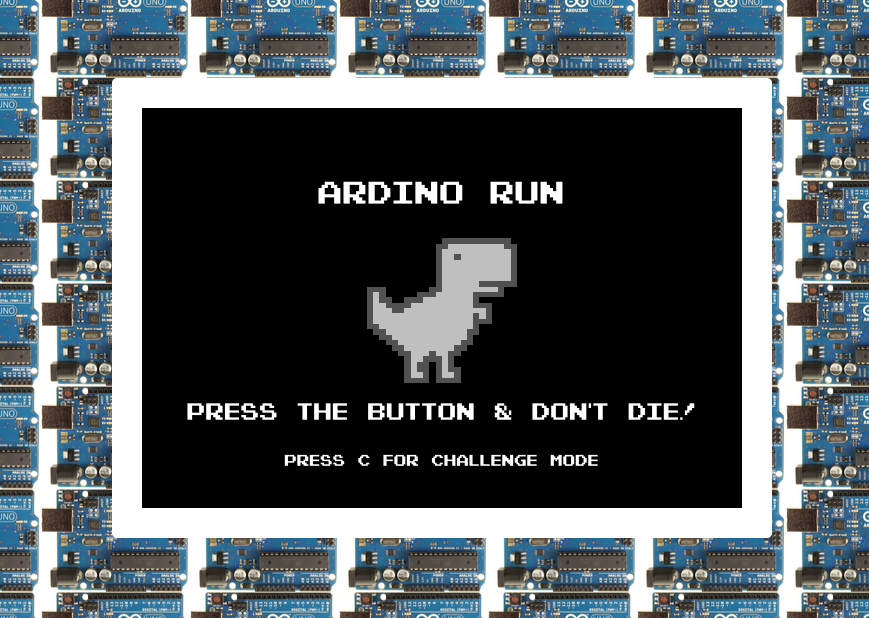
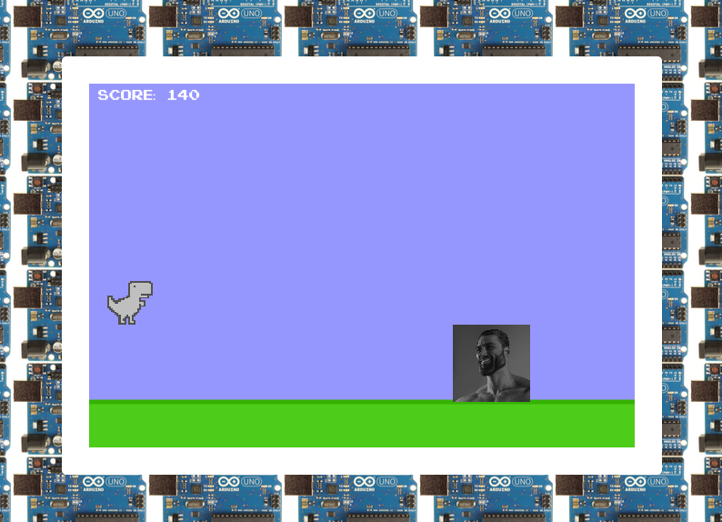
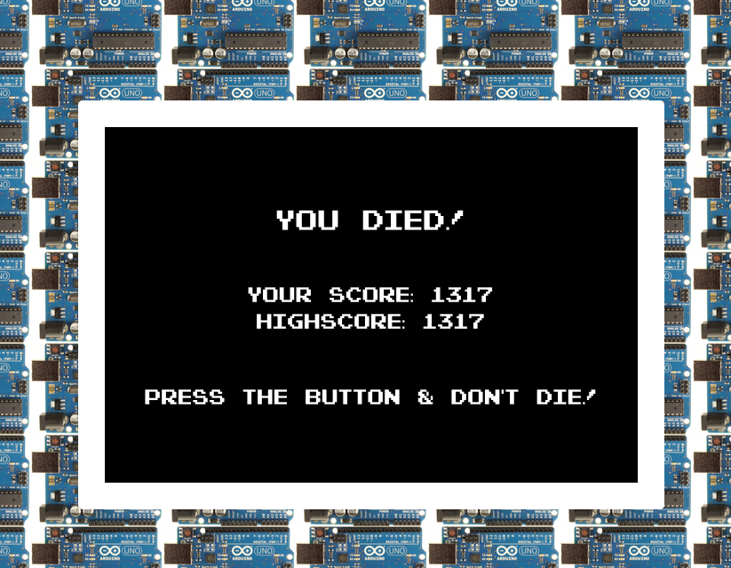

# ArDino game
A clone of the [Chrome Dino game](https://en.wikipedia.org/wiki/Dinosaur_Game) controlled by an Arduino.

## Screenshots
  
The main menu, with instructions & very fancy graphics 

---

   
Exciting gameplay showing our brave dinosaur protagonist jumping over gigachad

---

   
He did not survive. :\(   
This page shows the player's score as well as the highscore.

## Features
* The player can control the dinosaur by pressing `Space` or by pressing the button on the breadboard
* When the player starts a new game, a tune is played via the Piezo speaker. The tune was _inspired_ by theme song from Super Mario Bros.
* For the brave, there is a 'challenge mode.'  
  In challenge mode, a flashlight flickers in your face.  
  ***Tip:*** For extra difficulty, turn off lights.
* A potentiometer controls blending between two different backgrounds.  
  ***Tip:*** Don't use it.
* Highscore keeping persists between reload, as it is stored in memory on the server. Restarting the server will also reset highscores.

## Tools used
### Hardware
* An [Arduino Uno Rev3](https://store.arduino.cc/products/arduino-uno-rev3)
* A computer to run the game and server on
* USB A/B cable
* An iPrototype Arduino Starter Kit (This does not seem to be available anymore)
  * Breadboard
  * Piezo beeper
  * Potentiometer
  * Resistors
* An LED from a newly-destroyed flashlight
* An NPN Transistor (for controlling LED)
* Wires & alligator clips

### Software
* Node.js + Express (server)
* johnny-five.js (library for controlling the arduino from the computer with JavaScript)
* socket.io (a WebSocket library for communication between the server and the client)
* p5.js (a JavaScript canvas library for graphics)

## Installation
1. [Download and install NodeJS](https://nodejs.org/en/download)
2. Download this git repository from the Github website or run   
    ```git clone https://github.com/MaikoVDV/informatica-arduino-project.git```
3. Install the server's dependencies by running   
   ```npm install socket.io johnny-five express```
4. Connect your Arduino to the computer using the USB cable.
5. Enter the ```informatica-arduino-project``` directory and run  
   ```npm start```   
   ***Tip:*** If this step fails with `Error Opening COM3: File not found`, then the Arduino was not detected by johnny-five. Try removing `{port: "COM3"}` from index.js, and retry to see which ports are available.
6. In your browser, go to [`localhost:3000`](http://localhost:3000) to play the game

## Documentation
The code is documented with comments. To get the best idea of how this all works, please see the [source code](./index.js)  
If that *doesn't* sound like fun, here's a rough step-by-step guide to how it all works.

1. When you run `npm start`, Node.js runs [`index.js`](./index.js).
2. Express makes the static HTML files available on [`localhost:3000`](http://localhost:3000)
3. A WebSocket server is made on port 8080.
4. johnny-five connects to the Arduino on USB port `"COM3"`. This was done due to some errors I had on my machine. It may not work on your computer.
5. When the client connects to the WebSocket, EventListeners are added to some socket endpoints and some of the Arduino components.

---

6. When you open [localhost:3000](http://localhost:3000) in your browser, the server sends you the static files registered in step 2.
7. The browser fetches several resouces (mostly JavaScript files) specified in [`index.html`](./arduino-control/index.html)
8. p5.js runs `setup()` in [`sketch.js`](./arduino-control/p5-game/sketch.js)
9. The client connects to the WebSocket server and loads several images and fonts needed for the game.
10. Some EventListeners are added to the WebSocket which respond to inputs sent by the Arduino. The highscore is also updated when a `current_highscore` message is received.
11. The `draw()` function is called every frame. Based on the current state of the game (`game`, `main-menu` or `dead-screen`), some function is called.  
    *Note:* Assuming `runGame` is called in `draw()` function for these next steps.
12. Before the game is started, `setupGame()` is called. This resets score, player data and enemy spawning.
13. The environment is drawn. This includes the background and the grass below.
14. All the enemies are drawn and updated.
15. The player is drawn and updated.
16. Collision is checked between the player and the leftmost enemy.  
    Skipping checks for the other enemies saves on performance and shouldn't cause any problems because the player is always on the left side of the screen, so the only enemy that could be colliding with it is the leftmost one.
17. If the player collides with an enemy, then `gameState` changes to `"dead-screen"`, and the game is over.

There are many more parts to this game, like challenge mode, getting input, state management and how players and enemies are actually updated and drawn. Please see the [source code](./arduino-control/p5-game) for more on that.

## Sources
* [The johnny-five website](http://johnny-five.io/api/) for documentation and examples for the Arduino library.
* [The markdown guide](https://www.markdownguide.org/basic-syntax) for documentation on how to write .md files (like the one you're reading right now)
* [Interactief ontwerpen met Arduino](https://sites.google.com/site/hwcontwerpen/interactief-ontwerpen-met-arduino)
* [Fireship's video on WebSockets and socket.io](https://www.youtube.com/watch?v=1BfCnjr_Vjg)
* [p5.js reference](https://p5js.org/reference/) for examples on the various p5.js functions.
* [Toptal's JavaScript keycode tool](https://www.toptal.com/developers/keycode) for finding the numbers associated with keys pressed. This was necessary for handling keyboard inputs in the game.

## Development process
This project was made in a week (more reallistically: 3 days). I (Maiko) made it by myself, as I wanted the freedom to made dumb stuff, switch ideas and experiment.  
The original plan for this project was to run the dino game on two [8x8 dot matrix displys](https://opencircuit.nl/product/8x8-dot-matrix-display-rood-3mm-common-anodehttps://opencircuit.nl/product/8x8-dot-matrix-display-rood-3mm-common-anode). Unfortunately though, I didn't realise that these things need driver boards to work. Plugging them into a breadboard would take hours to program manually, and would probably be too complex to even do successfully.  
So, I pivoted to instead create a web game with p5.js. Years ago, I used it quite a lot, and I'd even made the dino game a couple of times, like [this one](https://editor.p5js.org/MaikoVDVeen/full/SyqhImqFm) from 2018. Later, I decided to use WebSockets for communicating with the server, instead of HTTP requests like I'd planned to. This allowed for easier communication, and most importantly: it was two-way, meaning the server could send inputs to the client.